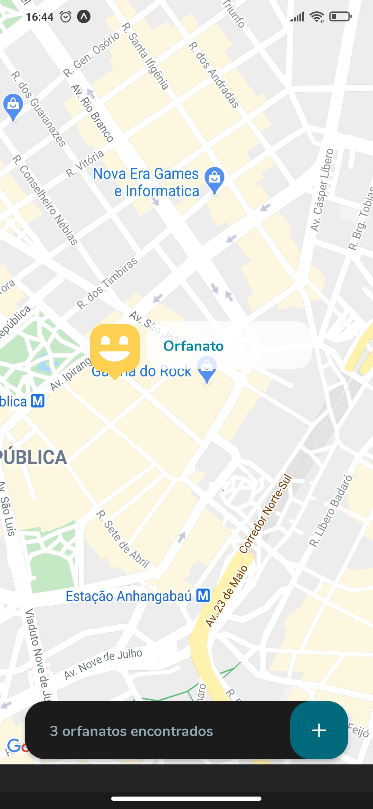
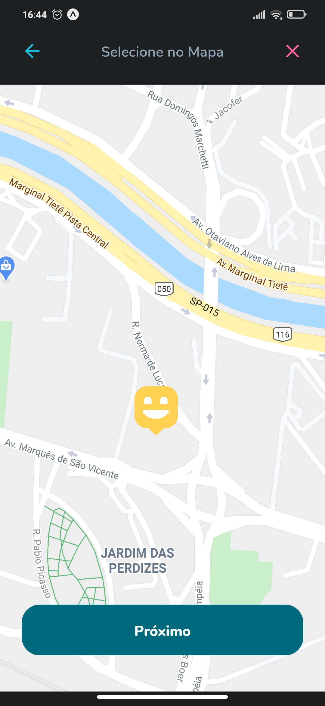
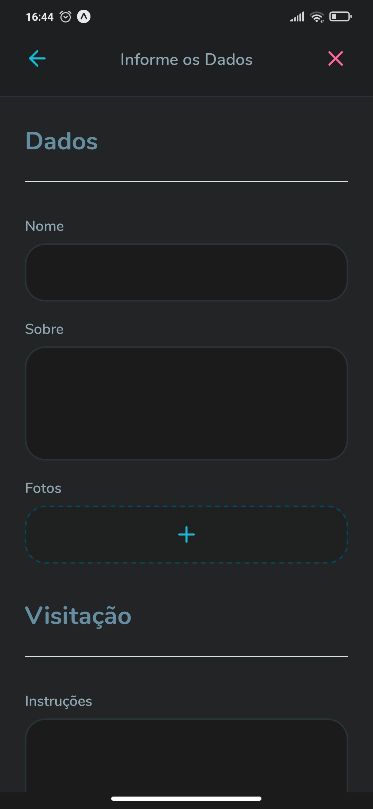
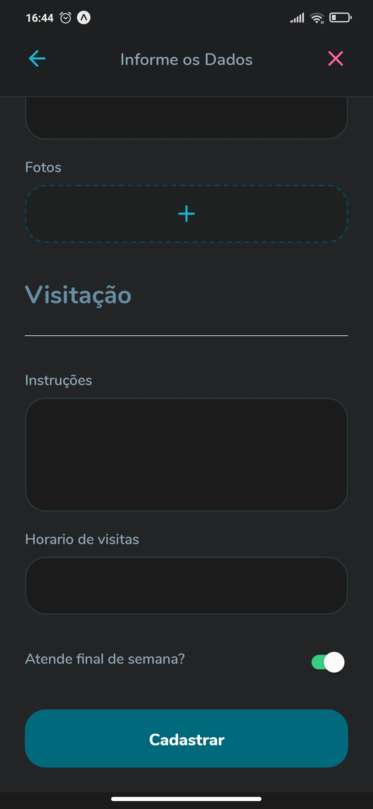
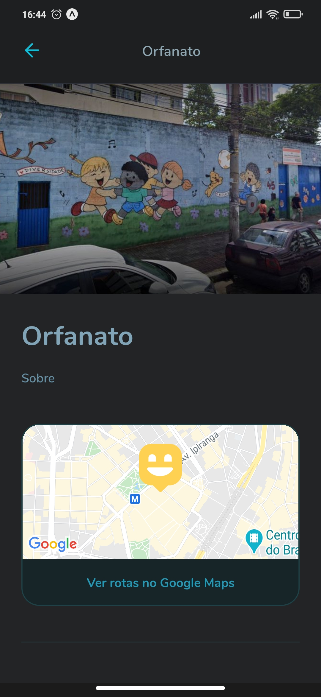
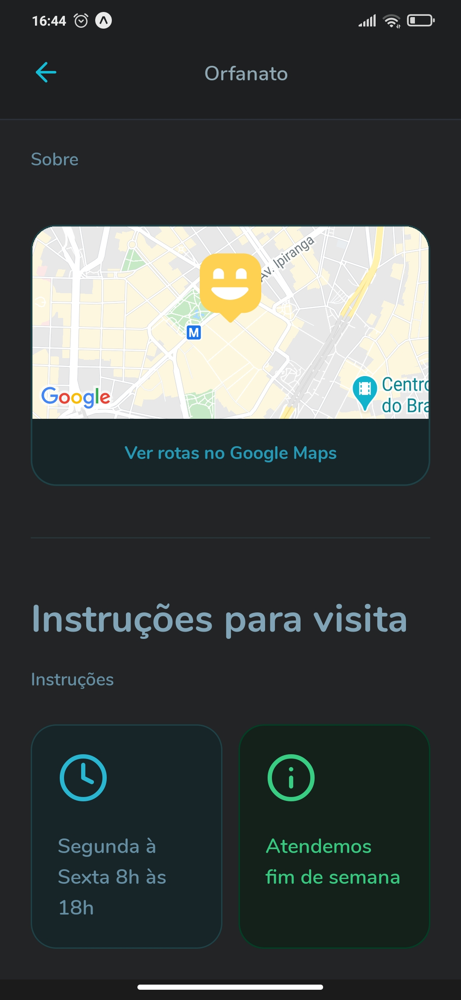

<h1 align="center">Happy<h1>

## Descrição ✍️

  O happy é uma plataforma de orfanatos, onde você pode fazer a criação de orfanatos, com detalhes para visitação, desenvolvida no next level week. Os orfanatos ficam salvos em um banco de dados onde você pode acessar tanto da aplicação web, quando no aplicativo mobile.

&nbsp;

  
  
  
  
  
  

  ## Mobile
  &nbsp;

  
  
  
  
  
  
  

 <a href="#objetivo">Objetivo</a> •
 <a href="#tecnologias">Tecnologias</a> •
 <a href="#run">Run</a> •
 <a href="#autor">Autor</a>

## Objetivo 🚀

   Com o dia das crianças, a rocketseat decidiu criar o happy, para que assim possamos criar pontos (orfanatos) na aplicação web e mobile para que, assim, possamos visitar orfanatos e fazer com que o dia das crianças seja ainda mais incesquecível.

&nbsp;
## Tecnologias 👩‍💻

 
 - Node.js
 &nbsp;
 - React
 &nbsp;
 - React Native
 &nbsp;
 - Expo
 &nbsp;
 - TypeScript
 &nbsp;
 - SQlite
 &nbsp;
 - Axios

&nbsp;
## Run 🏁

  1º Para rodar o projeto é necessário instalar todas as dependências, e para isso basta executar o comando `yarn install`.
  &nbsp;

  2º Afim de iniciar o servidor, após instalar as depencências, execute o comando `cd backend` e `yarn dev` no terminal.
  &nbsp;

  3º Após isso, abra outro terminal para inciar o projeto mobile, web, ou os dois, executando `cd web` e/ou `cd mobile`,e após isso, execute `yarn start`.

  4º No caso do mobile, é necessário baixar o expo na google play ou apple store, e ler o qr code para iniciar o aplicativo.

&nbsp;
## Autor
<a style="text-decoration: none;" href="https://github.com/olagregs">
  
  
Gregory Ferreira 💻

</a>

Made with ❤️ and ☕ by me 😁

&nbsp;